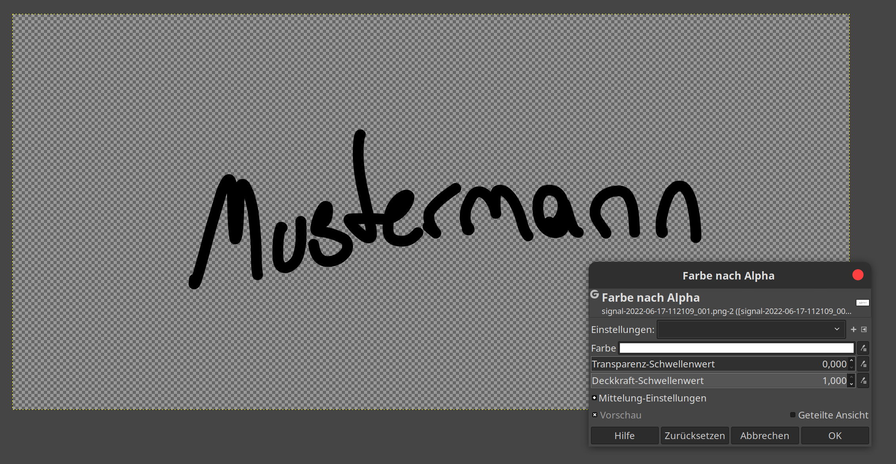

# FSI-Urkunde

Diese LaTeX-Vorlage kann zum Erstellen der FSI Lehrpreis-Urkunde und anderen Urkunden verwendet werden.

## Voraussetzungen
- $\LaTeX$-Distribution (auf Windows: MikTex, auf Mac/Linux: TeXLive)
- TeX-Pakete `geometry`, `tikz`, `anyfontsize`, `graphicx` `roboto`, `fontenc`, `ngerman` und `xcolor`
- Editor des Vertrauens

## Konfiguration des Dokuments
Die Texte, Farben, sowie einige Abstände und Schriftgrößen können direkt in der Präambel des Dokuments bearbeitet werden.
Hierzu ist jeweils mit `\newcommand` ein eigenes Kommando definiert:
- `\headercolor` legt die Farbe des Kopfabschnittes ("Urkunde der Fachschaft Informatik" und Fakultätsschriftzug) fest. Mögliche Farben sind [hier](https://de.overleaf.com/learn/latex/Using_colours_in_LaTeX#Named_colours_provided_by_the_xcolor_package) zu finden.
- `\traeger` legt fest, an wen die Urkunde ausgestellt werden soll.
- `\ueberreicht` ist die FSI-Person, die die Urkunde überreicht.
- `\unterschriftgrafik` kann verwendet werden, um eine Grafik für eine Unterschrift einzubinden, falls die Urkunde nicht von Hand unterschrieben wird. **Falls die Unterschrift von Hand geschieht, diese komplette \newcommand-Zeile mit % auskommentieren!**
- `\unterschriftversatz` ist der Grundlinienversatz für die Unterschriftenlinie und kann benutzt werden, um die virtuelle Grundlinie der Unterschrift und der gepunkteten Linie anzugleichen. Je negativer dieser Wert (z.B. -3mm), desto weiter nach unten wird die Unterschrift-Grafik geschoben. Kommt nur zum Tragen, wenn `\unterschriftgrafik` aktiv ist. 
- `\widmung` ist die persönliche Widmung. Hier kann auf spezielle Aspekte eingegangen werden, warum Prof. XYZ jetzt diese Urkunde erhält.
- `\widmungsize` ist die Textgröße der Widmung. Steht standardmäßig auf `\Large`, kann aber kleiner gestellt werden, falls der Platz nicht reicht. Die nächstkleineren Größen sind, in dieser Reihenfolge: `\large`, `\normalsize` und `\small`.

## Denker-Grafik (Danger Zone)
- Sollte das Denker-Wasserzeichen nicht gewünscht sein, kurz nach `\begin{document}` die Zeile `\denker` mit % auskommentieren, dann ist das Wasserzeichen deaktiviert. 
- Das Denker-Wasserzeichen stammt ursprünglich aus der Illustrator-Version von @octobi.
- Die Positionierung des Urkunden-Headers (vor allem der Linie unter dem Wort "Urkunde") basiert auf dem Denker-Wasserzeichen, welches selbst einen Absatz im oberen Bereich hat.
- Wird der Inhalt der Denker-Grafik geändert, muss der Abstand in der Urkunden-Zeile ebenfalls geändert werden, ansonsten ist die Linie nicht mehr bündig.

## Exkurs: Unterschrift transparent machen mit GIMP
- Soll die Unterschrift digital verwendet werden, diese am Besten auf dem Tablet schreiben und als PNG-Grafik exportieren.
- Meistens ist hier dann jedoch noch der weiße Hintergrund vorhanden, was wir nicht haben wollen. 
- Hintergrund kann mit GIMP unter Ebene→Transparenz→Farbe nach Alpha... entfernt werden.
	- ggf. weißes Farbfeld anklicken und mit der Pipette die Hintergrundfarbe auswählen, falls sie nicht rein weiß ist.
- Anschließend Grafik beschneiden, sodass möglichst wenig Freiraum um die Unterschrift vorhanden ist.
- Als PNG im `img`-Verzeichnis abspeichern und Dateinamen in der `\unterschriftgrafik`-Zeile anpassen.

